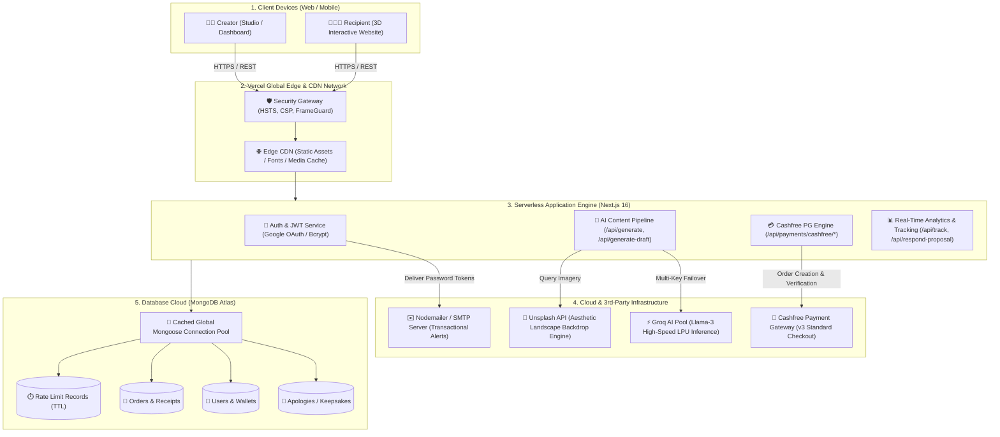
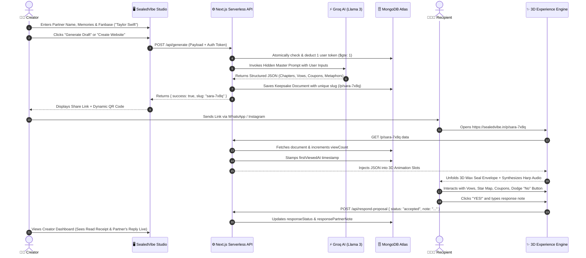
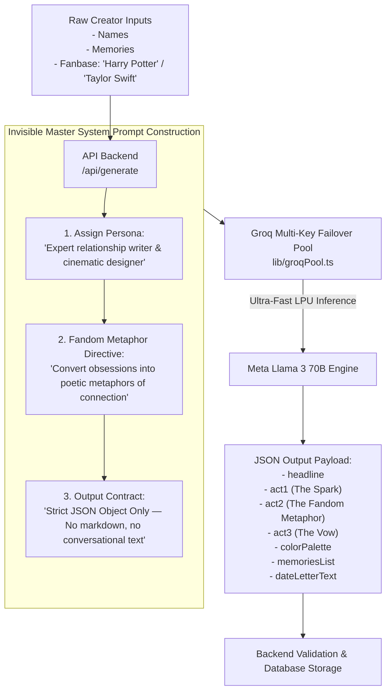
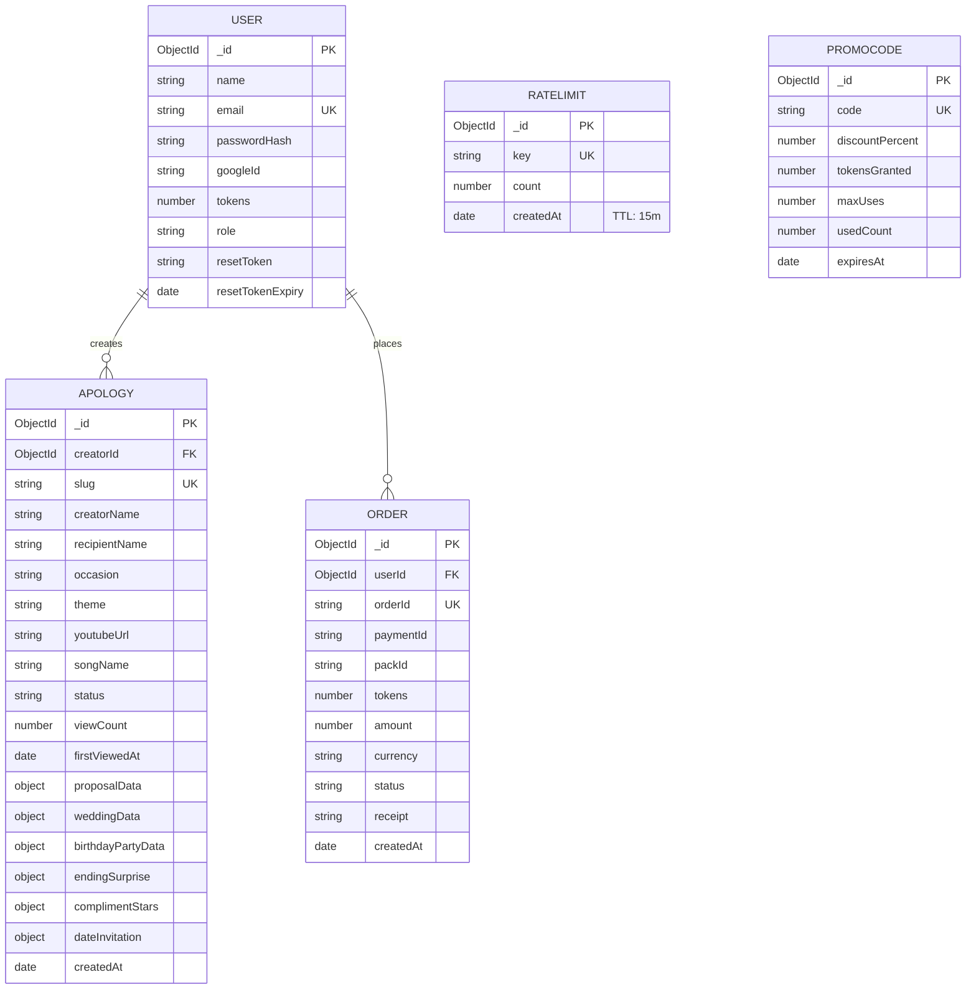
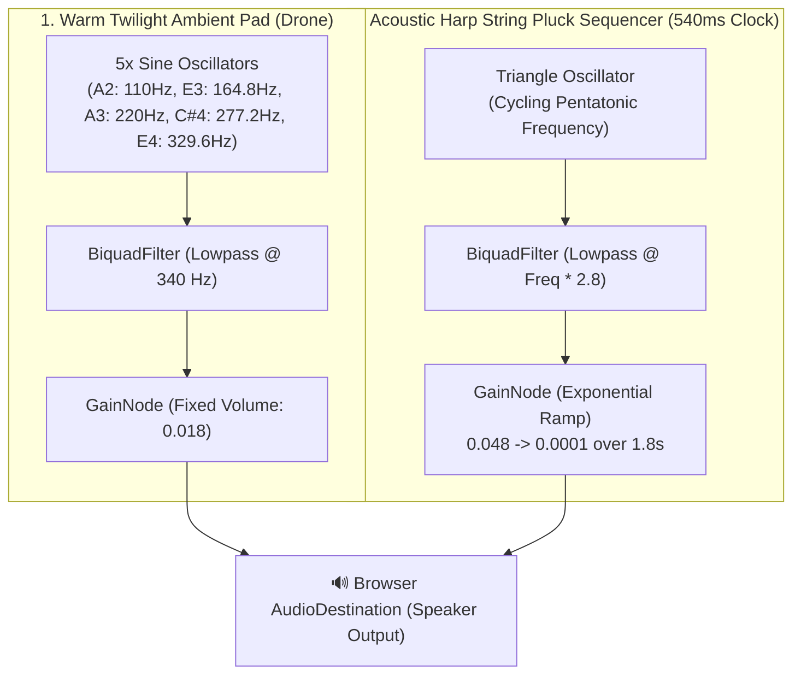
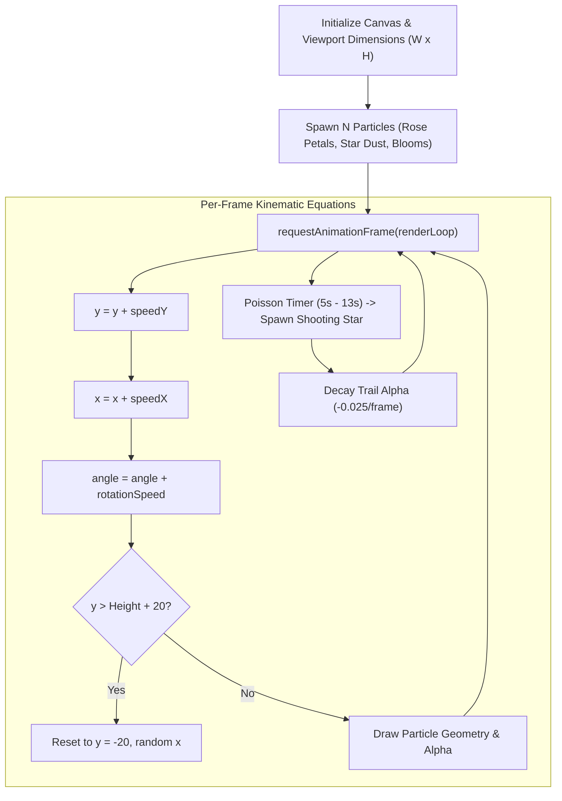
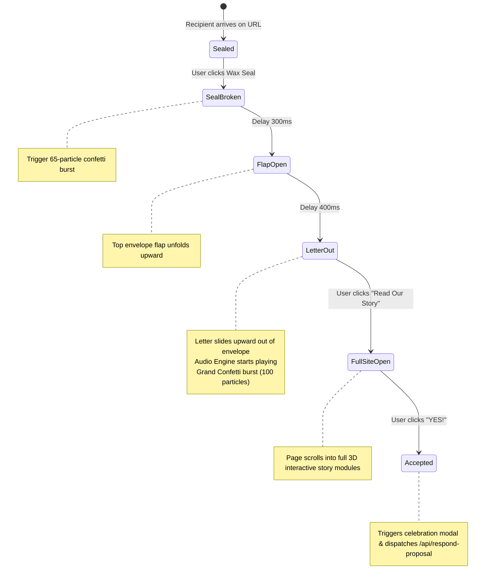
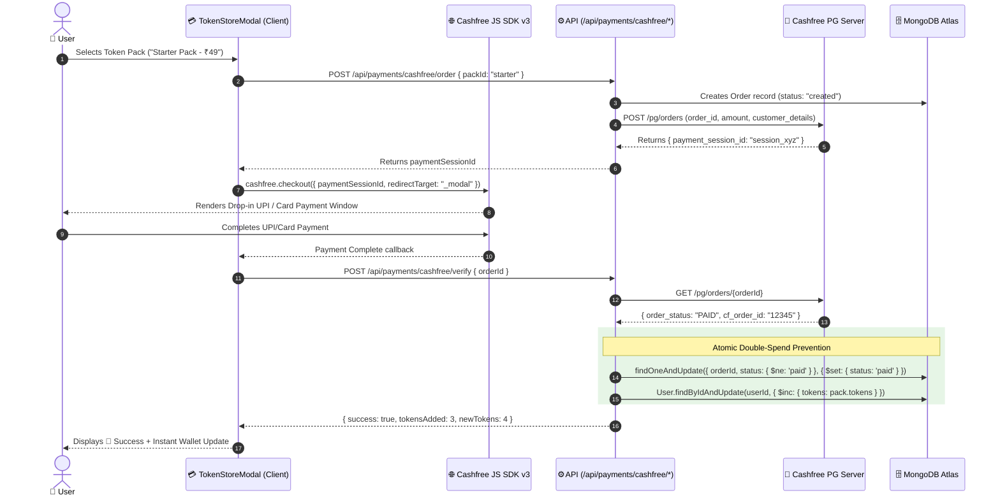
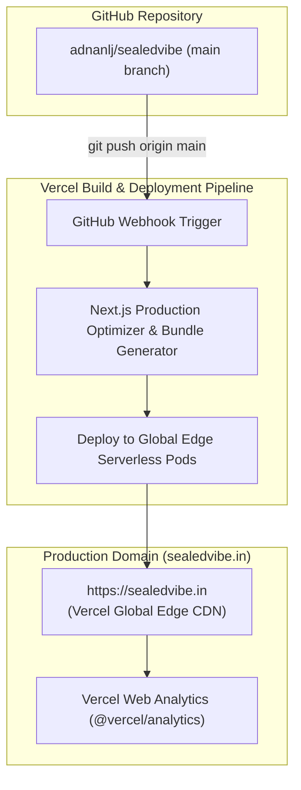

# 🌟 SealedVibe — Comprehensive System Architecture & Engineering Blueprint

---

## 1. Executive Summary & System Vision

**SealedVibe** is a high-performance, emotionally immersive web platform that turns raw personal memories, apologies, romantic proposals, and celebrations into cinematic **3D interactive web experiences**. 

The system operates without manual coding per website: a creator provides basic relationship facts and optional pop-culture fandoms, an ultra-fast LLM engine (Groq) synthesizes structured story modules, and our dynamic client-side 3D rendering engine injects the data into an interactive 3D universe with background music, physics-based animations, and real-time read/response tracking.

---

## 2. High-Level Architecture (HLA)

---

## 3. End-to-End System Workflow (Sequence Diagram)

---

## 4. Groq AI Story-Weaving & Fanbase Metaphor Engine

When the user enters raw inputs, the backend wraps them with a **Hidden Master System Prompt** before passing them to the Groq Multi-Key Pool.

### Fanbase Metaphor Translation Examples:
* **Taylor Swift**: Synthesizes lines around *"invisible strings"*, *"midnight conversations"*, and *"enchanted memories"*.
* **Harry Potter**: Weaves in *"Golden Snitch finding"*, *"Patronus of joy"*, and *"After all this time? Always"*.
* **Marvel / Sci-Fi**: Embeds themes of *"destiny across every multiverse"*.

---

## 5. The No-Code 3D Engine & Template Injection Concept

We do not generate new source code files for every website. Instead, the application utilizes a **Pre-Engineered Master 3D Skeleton Component** ([`RomanticProposal.tsx`](file:///c:/Users/ADNAN/OneDrive/Desktop/apology_web_maker/components/RomanticProposal.tsx)):

```mermaid
graph LR
    subgraph Database["MongoDB Data Store"]
        JSONData["Structured JSON Document\n{ partnerName, chapter1Text, promises, coupons, youtubeUrl }"]
    end

    subgraph MasterComponent["Master 3D Engine (RomanticProposal.tsx)"]
        Slot1["Slot: Envelope Wax Seal Label"]
        Slot2["Slot: Falling Rose Petals & Stardust Canvas"]
        Slot3["Slot: Web Audio Synth Harp + YouTube Player"]
        Slot4["Slot: 3D Perspective Card Whispers"]
        Slot5["Slot: Interactive Constellation Star Map"]
        Slot6["Slot: Redeemable Love Coupons"]
        Slot7["Slot: Spring Physics Dodge Button"]
    end

    JSONData -->|Runtime State Injection| MasterComponent
    MasterComponent --> RenderedDOM["✨ Fully Interactive Recipient Experience"]
```

---

## 6. Low-Level System Design & Database Models

---

## 7. Web Audio API Digital Signal Processing (DSP) Pipeline

The browser synthesizes dynamic acoustic harp plucks and ambient twilight pads locally without external audio streaming dependencies:

---

## 8. HTML5 Canvas 60 FPS Particle Physics Engine

---

## 9. 3D Wax-Seal Envelope Finite State Machine (FSM)

---

## 10. Cashfree Payment Gateway & Concurrency-Safe Token Credit

---

## 11. Security, Authentication & Rate Limiting

| Security Domain | Mechanism Implemented | Implementation File |
| :--- | :--- | :--- |
| **Password Security** | Bcrypt with salt cost factor 10 | [`app/api/auth/signup/route.ts`](file:///c:/Users/ADNAN/OneDrive/Desktop/apology_web_maker/app/api/auth/signup/route.ts) |
| **Session Cryptography** | `HS256` JWT cookies with `httpOnly`, `sameSite: "lax"`, `secure` | [`lib/session.ts`](file:///c:/Users/ADNAN/OneDrive/Desktop/apology_web_maker/lib/session.ts) |
| **API Rate Limiting** | Sliding window IP limiter (Max 5 generations/minute, Max 10 logins/minute) | [`lib/rateLimit.ts`](file:///c:/Users/ADNAN/OneDrive/Desktop/apology_web_maker/lib/rateLimit.ts) |
| **DDoS & Header Shield** | HSTS (`max-age=63072000`), `X-Frame-Options: SAMEORIGIN`, `X-Content-Type-Options: nosniff` | [`next.config.ts`](file:///c:/Users/ADNAN/OneDrive/Desktop/apology_web_maker/next.config.ts) |
| **Private Envelopes** | Optional recipient passcodes stored as cryptographic hashes | [`app/api/verify-passcode/route.ts`](file:///c:/Users/ADNAN/OneDrive/Desktop/apology_web_maker/app/api/verify-passcode/route.ts) |

---

## 12. Deployment Topology & Cloud Infrastructure

---
*Document generated for **SealedVibe Architecture Standard (2026)**.*
